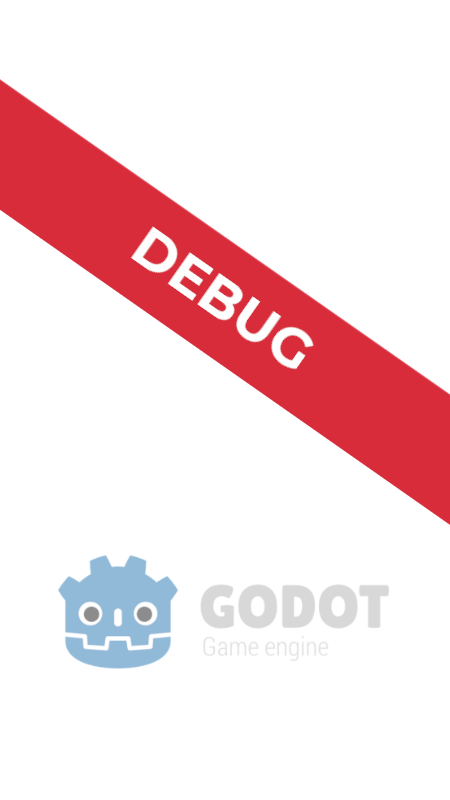

#  Factoria

[![release][1]][2] [![license][3]][4]

Factoria is a **Godot game** for 💻**PC** / 🌐**Web**.

## Install & Setup

1. Download the 💻*binary* from **[releases](https://github.com/GreenDjango/Factoria/releases)**
2. Run the app
3. Enjoy with `Factoria` !
4. Optional: `rm -rf *` for delete all your pc

---

#### Project realised by:
- **[@Théo C.](https://github.com/GreenDjango)** 🐙

[1]: https://img.shields.io/badge/release-v0.1.0-blue
[2]: https://github.com/GreenDjango/Factoria/releases 'GitHub release (latest by date)'
[3]: https://img.shields.io/badge/license-MIT-green
[4]: https://github.com/GreenDjango/Factoria/blob/master/LICENSE 'GitHub license'